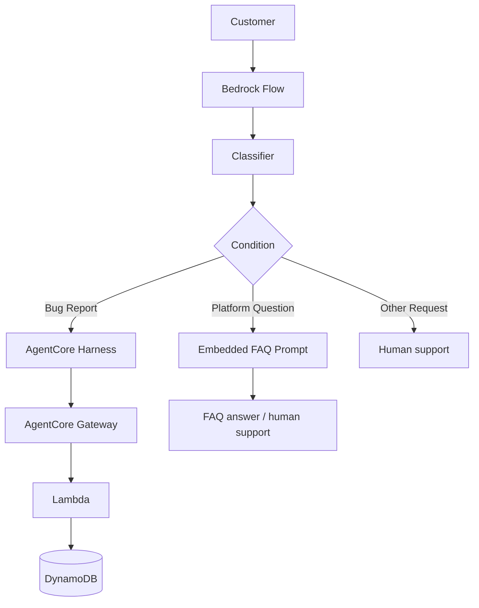

# Customer Support Chatbot

## Overview
This project implements an AI-powered customer support chatbot using Amazon Bedrock Flows. The chatbot intelligently classifies incoming customer messages and routes them to distinct paths: Bug Reports, Platform Questions, and Other Requests. It utilizes a Bedrock Flow for orchestration, an AgentCore Managed Harness and Gateway for tool use (bug reporting), and embedded FAQs for platform-related inquiries.

## Architecture


## Classification and Routing
The application uses a classifier prompt node at the start of the Bedrock Flow to categorize the user's message into exactly one of three categories: `Bug Report`, `Platform Question`, or `Other Request`. Based on this categorization, a Condition node evaluates the output using exact string matching and routes the execution to the corresponding distinct branch. Each path terminates in its own separate output node.

## Bug Report Path
The Bug Report path utilizes an AgentCore managed harness to interact with the customer. 
- The system prompt is strictly configured to ensure the assistant collects three mandatory pieces of information: **bug description**, **reproduction steps**, and **environment (browser/OS/device)**. 
- Strict collection rules explicitly prohibit the assistant from inferring or assuming missing details. The assistant must ask the customer for any missing information.
- Only when all three required fields are explicitly provided by the customer will the assistant invoke the `create_bug_report` tool.
- The AgentCore Gateway routes this tool call to a Lambda function, which persists the ticket into a DynamoDB table and returns a unique ticket ID to the customer.

## Platform Question Path
Platform questions (orders, shipping, payments, etc.) are routed to an FAQ Prompt node.
- The prompt has the company FAQ directly embedded within it.
- The model is instructed to answer the customer's question **only** using information found in the FAQ, without utilizing external knowledge or inventing policies.
- If the FAQ contains the answer, it is provided directly.
- If the exact question is not explicitly covered in the FAQ (e.g., asking if Bitcoin is accepted), the model does not guess. Instead, it provides a polite fallback response directing the user to human support at `1-800-123-4567` (available Mon-Fri).

## Other Request Path
General feedback, complaints, and other requests that do not fall under Bug Reports or Platform Questions are routed here. 
- The flow explicitly prevents the bug-report tool from being called.
- The model politely redirects the customer to human support by providing the phone number `1-800-123-4567` and the support hours.

## AgentCore Gateway and Harness
The project utilizes the AgentCore ecosystem to handle the bug report tool usage:
- **AgentCore Gateway**: Configured with a target named `bugreports`, exposing the Lambda function as an MCP tool named `bugreports___create_bug_report`.
- **AgentCore Managed Harness**: Named `support_chatbot`, pinning the `us.amazon.nova-pro-v1:0` model with a temperature of 0 and topK of 1 for deterministic, reliable collection behavior.

## Testing and Evaluation
The application was evaluated using Bedrock Evaluations with an LLM-as-a-judge model.
- **Automated Testing**: A suite of test prompts covering all three paths is defined in `flow-tests.json`.
- **Dataset Generation**: The `generate-eval-dataset.py` script automatically runs these test prompts against the Bedrock Flow and produces an `output_eval_dataset.jsonl` file.
- **Evaluation**: This dataset was uploaded to an S3 bucket and used to run a Bedrock Evaluation job to score the model's responses.

Detailed metrics and observations are documented in [EVALUATION.md](EVALUATION.md).

## Evidence

| Rubric | Requirement | Evidence | Status |
|---|---|---|---|
| 1.1 | Full classification/routing flow | evidence/1.1_full_flow.png | Complete |
| 1.2 | Classifier prompt | evidence/1.2_classifier_prompt.png | Complete |
| 1.3 | Condition expressions | evidence/1.3_condition_expressions.png | Complete |
| 2.1.1 | Bug-report system prompt | evidence/2.1.1_system_prompt_bug_rules.png | Complete |
| 2.1.2 | Bug collection + tool call | evidence/2.1.2_bug_report_chat.png | Complete |
| 2.1.3 | DynamoDB ticket | evidence/2.1.3_dynamodb_ticket.png | Complete |
| 3.1.1 | FAQ Prompt | evidence/3.1.1_faq_prompt.png | Complete |
| 3.1.2 | Covered FAQ | evidence/3.1.2_covered_faq.png | Complete |
| 3.1.3 | Uncovered FAQ | evidence/3.1.3_uncovered_faq.png | Complete |
| 3.1.4 | Other Request | evidence/3.1.4_other_request.png | Complete |
| 4.1 | Test suite | starter/flow-tests.json | Complete |
| 4.2 | Evaluation dataset | starter/output_eval_dataset_agentcore_final.jsonl | Complete |
| 4.3 | Bedrock Evaluation | evidence/4.1_bedrock_evaluation.png | Complete |
| 4.4 | Evaluation observation | EVALUATION.md | Complete |

## Project Structure
```
project/
├── starter/
│   ├── system_prompt.txt
│   ├── online_shop_faq.md
│   ├── flow-tests.json
│   ├── harness-tests.json
│   ├── generate-eval-dataset.py
│   ├── setup_gateway.py
│   ├── create_harness.py
│   ├── chat.py
│   ├── cloudformation-tool.yaml
│   ├── cloudformation-testing.yaml
│   ├── create_bug_report.py
│   ├── requirements.txt
│   ├── agentcore_config.json
│   └── output_eval_dataset_agentcore_final.jsonl
├── evidence/
│   ├── 1.1_full_flow.png
│   ├── 1.2_classifier_prompt.png
│   ├── 1.3_condition_expressions.png
│   ├── 2.1.1_system_prompt_bug_rules.png
│   ├── 2.1.2_bug_report_chat.png
│   ├── 2.1.3_dynamodb_ticket.png
│   ├── 3.1.1_faq_prompt.png
│   ├── 3.1.2_covered_faq.png
│   ├── 3.1.3_uncovered_faq.png
│   ├── 3.1.4_other_request.png
│   └── 4.1_bedrock_evaluation.png
├── README.md
└── EVALUATION.md
```
